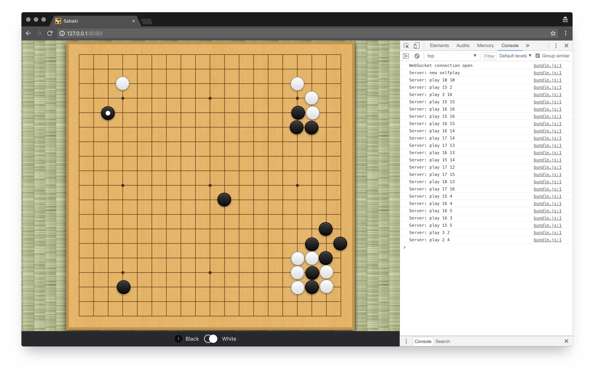

# AutoSabaki


An elegant [Leela Zero](https://github.com/gcp/leela-zero) AutoGTP visualiser for a more civilized age. [Download the latest release](https://github.com/Tenchi2xh/AutoSabaki/releases) of AutoSabaki.

**This fork is a special version of the web version of Sabaki.** Check out the original Sabaki project [here](https://github.com/SabakiHQ/Sabaki).



## Features

- Server hosts a special version of Sabaki
- Each page opened will spawn its own `autogtp` instance (closing will kill them)
- Games are viewed live in your browser!

## Running

Just run the main script in a folder where the `autogtp` and `leelaz` executables are present:

```
$ ./autosabaki.py

Serving Sabaki on http://127.0.0.1:8080/
Each tab opened will spawn a new instance of autogtp
Closing a tab will terminate its associated instance
----------------------------------------------------
Listening on port 3838 for clients..
[1] 23:56:34 - Spawning autogtp process.
[1] 23:56:34 - Client connected.
[1] 23:56:36 - Starting game 1.
[1] 00:15:54 - 1 game(s) (1 self played and 0 matches) played in 19 minutes = 1157 seconds/game, 5457 ms/move, last game took 1157 seconds.
[1] 00:15:54 - Starting game 2.
```

Note: you need to have valid installations of `python3` and `pip`.

## License

This project is licensed under the [MIT license](https://github.com/Tenchi2xh/AutoSabaki/blob/master/LICENSE.md).
